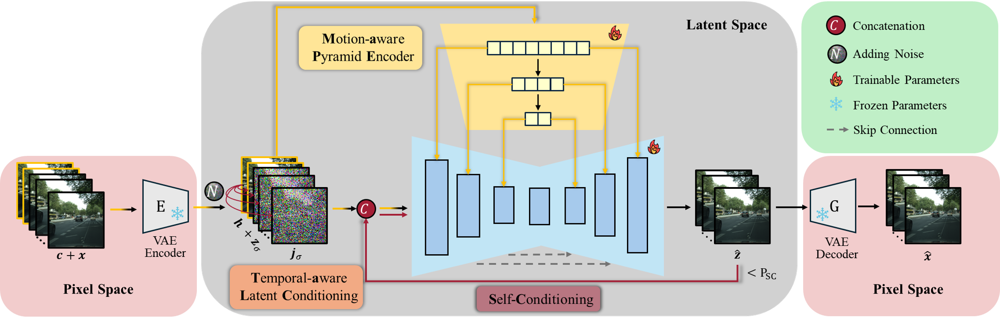

<div align="center">

# HMPDM: Historical Motion Priors-Informed Diffusion Model for Driving Video Prediction

**[Ke Li](https://kelisbu.github.io/)<sup>1</sup>, Tianjia Yang<sup>2</sup>, [Kaidi Liang](https://liangkd.github.io/)<sup>1</sup>, [Xianbiao Hu](https://sites.psu.edu/xbhu/xb-hu/)<sup>2</sup>, [Ruwen Qin](https://sites.google.com/stonybrook.edu/rqin/home)<sup>1</sup>\***

<sup>1</sup> Department of Civil Engineering, Stony Brook University  
<sup>2</sup> Department of Civil Engineering, Pennsylvania State University

[](https://arxiv.org/abs/2603.27371)
[](#license)
**🎉 Accepted by [IEEE IVS 2026] 🎉**
</div>

<div align="center">
  
</div>


## 📊 Results 


## 🚀 Quick Start
# HMPDM

This repository extends [Stable Video Diffusion](https://huggingface.co/stabilityai/stable-video-diffusion-img2vid-xt) (SVD) with a pyramid history encoder and self-conditioning, allowing the model to take several past frames as context and generate a longer future trajectory. The codebase includes the training script, the supporting model modules, and two evaluation scripts: one for qualitative trajectory sampling, and one for full-dataset quantitative evaluation.

## Repository layout

| File | Purpose |
|------|---------|
| `train_svd_fp16_selfatt.py` | Main training script. Trains a `SVD_UNet_WithHistCtx` (UNet + Pyramid history encoder) with optional self-conditioning and EMA. |
| `costunet_pyraid.py` | Model definitions: `CustomUNet`, `PyramidEncoder`, `PatchMerging2x2`, `ResidualFlowFusion3D`, `SVD_UNet_WithHistCtx`, plus the Transformer/Attention building blocks. |
| `evaluationsc.py` | Demo / qualitative evaluation. Generates one or more trajectories from a small subset of clips, reusing the same initial noise across clips for fair comparison. |
| `evaluationtotal.py` | Full quantitative evaluation. Streams the entire test set and produces one mp4 per clip. |
| `requirements.txt` | Pinned Python dependencies (PyTorch 2.6 / CUDA 12.4). |

## 1. Environment setup

The pinned versions in `requirements.txt` target CUDA 12.4. We recommend a fresh conda environment with Python 3.10:

```bash
conda create -n svd-xtend python=3.10 -y
conda activate svd-xtend

pip install -r requirements.txt
```

The first time the scripts run, they will download the base SVD weights from Hugging Face (`stabilityai/stable-video-diffusion-img2vid-xt`). If you do not have internet access from the training node, pre-download the snapshot and pass the local path through `--svdpretrained_model_name_or_path`.

Optional: install `xformers` for memory-efficient attention. If installed, you can enable it with `--enable_xformers_memory_efficient_attention`.

## 2. Dataset format

Both the training script and the evaluation scripts expect the data to be organized as one directory per clip, with sequentially numbered RGB frames inside:

```
<base_folder>/
├── clip_0001/
│   ├── 000.png
│   ├── 001.png
│   ├── ...
│   └── 029.png
├── clip_0002/
│   ├── ...
└── ...
```

Each clip directory must contain at least `F_hist + F_future` frames (e.g. 30 for the default 2 + 28 split used in the evaluation scripts, or 20 for the default 4 + 16 used in training). Frames are sorted by the numeric portion of the filename. Both `.png`, `.jpg`, and `.jpeg` are accepted.

## 3. Training

The training script trains the joint UNet + history encoder. The two important hyper-parameters are `--F_hist` (number of history frames used as context) and `--F_future` (number of frames to predict); their sum must equal `--num_frames`.

A typical training command on a single multi-GPU node:

```bash
accelerate launch train_svd_fp16_selfatt.py \
    --base_folder /path/to/your/training/clips \
    --output_dir ./outputs/svd_run1 \
    --svdpretrained_model_name_or_path stabilityai/stable-video-diffusion-img2vid-xt \
    --width 128 --height 128 \
    --F_hist 2 --F_future 28 --num_frames 30 \
    --per_gpu_batch_size 1 \
    --gradient_accumulation_steps 1 \
    --gradient_checkpointing \
    --learning_rate 1e-4 \
    --lr_scheduler cosine --lr_warmup_steps 3165 \
    --max_train_steps 100000 \
    --checkpointing_steps 5000 \
    --checkpoints_total_limit 2 \
    --mixed_precision fp16 \
    --p_sc 0.9 \
    --use_ema \
    --seed 123
```

Notes on the most relevant flags:

- `--base_folder` is the root directory holding the per-clip subfolders described above.
- `--num_frames` must equal `--F_hist + --F_future`. The script asserts this internally.
- `--p_sc` is the probability of applying self-conditioning during a step (the model first runs a no-grad forward with GT condition, then re-runs with the predicted future as condition).
- `--use_ema` enables a cross-device EMA copy of both the UNet and the history encoder; checkpoints are saved together under `checkpoint-<step>/`.
- `--mixed_precision fp16` is the tested setting; bf16 also works on Ampere or newer GPUs.
- `--gradient_checkpointing` is recommended at 128×128 / 30 frames to fit on a single 24 GB GPU.

Resume from the latest checkpoint by passing `--resume_from_checkpoint latest`.

Each saved checkpoint contains:

```
checkpoint-XXXXX/
├── unet/                  # diffusers-style UNet snapshot
├── ctx_encoder.pt         # PyramidEncoder state_dict
├── unet_ema.pt            # (if --use_ema) EMA shadow weights
└── ctx_encoder_ema.pt     # (if --use_ema) EMA shadow for the history encoder
```

A `loss.csv` is written to `--output_dir` at the end of training for plotting.

## 4. Evaluation

Two evaluation scripts are provided. Both read clips from disk in the same per-clip-folder layout, encode the first `F_hist` frames as conditioning, and generate `F_future` future frames using the trained UNet + history encoder. The output of each clip is saved as an mp4.

Both scripts currently contain **hard-coded paths** at the top of `main()` (checkpoint directory, dataset path, output root). Edit these before running.

### 4.1 Qualitative demo (`evaluationsc.py`)

Use this script when you want to compare several trajectories on the same handful of clips, all starting from the same initial noise. By default it samples a single clip and runs one trajectory; loop over `range(N)` in the trajectory loop to produce N variants.

```bash
python evaluationsc.py
```

Key constants you typically edit at the top of `main()`:

- `device = "cuda:2"` — change to your free GPU.
- `unet = CustomUNet.from_pretrained(...)` and `ctx_path = ...` — point to your trained checkpoint folder.
- `DummyDataset('/path/to/clips/', ...)` — point to the dataset to sample from.
- `OUT_ROOT_BASE = ...` — output directory for the generated mp4s.
- `F_hist`, `F_future`, `sample_frames` — must satisfy `F_hist + F_future == sample_frames`.

### 4.2 Full-dataset evaluation (`evaluationtotal.py`)

Use this script to run inference on every clip in a test set. It streams clips from disk one at a time (no caching) and writes an mp4 per clip:

```bash
python evaluationtotal.py
```

The same hard-coded constants at the top of `main()` need to be set: checkpoint path, dataset path (e.g. KITTI test split), and `OUT_ROOT_BASE`. The default configuration uses `F_hist=2, F_future=28` and 50 inference steps with the `EulerDiscreteScheduler`.

The two scripts are intentionally similar; the main difference is that `evaluationsc` takes the **last** `sample_frames` of each clip (useful for picking the most recent context window), while `evaluationtotal` takes the **first** `sample_frames` (useful when ground-truth alignment matters during scoring).

## 5. Output format

For both training and evaluation, results are written under the directory you specify. Generated videos are encoded with `cv2.VideoWriter` using the `mp4v` codec; frame size matches `(width, height)` and the framerate is set inside the script (17 fps for `evaluationsc`, also 17 by default for `evaluationtotal`).

## 6. Tips

- The history encoder's `input_size` must equal `height // 8` and be divisible by 8 (the script uses three `/2` downsampling stages).
- If you change `--F_hist`, also update the `PyramidEncoder(input_size=..., num_frames=...)` line in the evaluation scripts so the shapes match.
- The learning rate, warmup, and EMA decay are tuned for the default Cityscapes / KITTI-style settings; if you train on a markedly different dataset, expect to retune.


