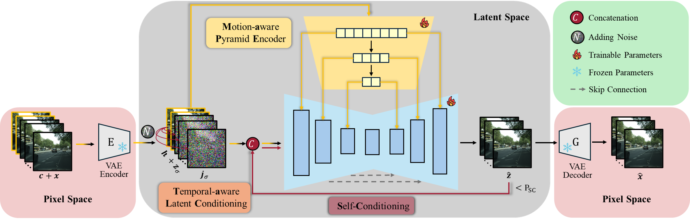

<div align="center">

# HMPDM: Historical Motion Priors-Informed Diffusion Model for Driving Video Prediction

**[Ke Li](https://kelisbu.github.io/)<sup>1</sup>, Tianjia Yang<sup>2</sup>, [Kaidi Liang](https://liangkd.github.io/)<sup>1</sup>, [Xianbiao Hu](https://sites.psu.edu/xbhu/xb-hu/)<sup>2</sup>, [Ruwen Qin](https://sites.google.com/stonybrook.edu/rqin/home)<sup>1</sup>\***

<sup>1</sup> Department of Civil Engineering, Stony Brook University
<sup>2</sup> Department of Civil Engineering, Pennsylvania State University

[](https://arxiv.org/abs/XXXX.XXXXX)
[](https://huggingface.co/Ke66668888/HMPDM-Cityscapes)
[](#license)

**🎉 Accepted by [IEEE IVS 2026] 🎉**
</div>

<div align="center">
  
</div>


## Repository layout

```
.
├── models.py          # TaLCUNet, MaPE, HMPDM, plus PatchMerging2x2 / Attention / TransformerBlock
├── train.py           # Training script (TaLC + MaPE + SC), checkpoints UNet and MaPE together
├── evaluate.py        # Full-test-set + 256-random-sample evaluation, argparse driven
├── evaluate_demo.py   # Qualitative demo: sample N clips, run K trajectories on the same noise
├── requirements.txt   # Pinned Python dependencies (PyTorch 2.6 / CUDA 12.4)
├── scheduler/         # EulerDiscreteScheduler config
└── README.md
```

## 1. Environment setup

The pinned versions in `requirements.txt` target CUDA 12.4. We recommend a fresh conda environment with Python 3.10:

```bash
git clone https://github.com/KELISBU/HMPDM.git
cd HMPDM
conda create -n hmpdm python=3.10 -y
conda activate hmpdm
pip install -r requirements.txt
```

The first time the scripts run, they will download the base SVD weights from Hugging Face (`stabilityai/stable-video-diffusion-img2vid-xt`). For air-gapped nodes, pre-download the snapshot and pass the local path through `--svdpretrained_model_name_or_path` (training) or `--vae_path` / `--scheduler_dir` (evaluation).

Optional packages: `xformers` (memory-efficient attention, enable via `--enable_xformers_memory_efficient_attention`), `bitsandbytes` (8-bit Adam, `--use_8bit_adam`), `wandb` (`--report_to wandb`), `tensorboard` (default logger).

## 2. Datasets

The paper reports results on:

| Dataset | Train clips | Test clips | Frames per clip | Resolution | Split |
|---------|-------------|------------|-----------------|------------|-------|
| Cityscapes | 2,975 | 1,525 | 30 | 128 × 128 | 2 → 28 |
| KITTI      |   759 |   150 |  9 | 128 × 128 | 4 → 5 |

Both training and evaluation expect data laid out as **one subdirectory per clip**, with sequentially numbered RGB frames inside. The train and test splits live in separate top-level folders; `train.py` and `evaluate.py` each point at one of them:

```
<dataset_root>/
├── train/                          ← pass as --base_folder for train.py
│   ├── video_001/
│   │   ├── 000.png
│   │   ├── 001.png
│   │   └── ...
│   ├── video_002/
│   │   └── ...
│   └── ...
├── val/                          ← pass as --base_folder for train.py
│   ├── video_001/
│   │   ├── 000.png
│   │   ├── 001.png
│   │   └── ...
│   ├── video_002/
│   │   └── ...
│   └── ...
└── test/                           ← pass as --data_dir for evaluate.py
    ├── video_001/
    │   └── ...
    └── ...
```

Each clip directory must contain at least `F_hist + F_future` frames. Frames are sorted by the numeric portion of the filename. `.png`, `.jpg`, and `.jpeg` are accepted.

## 3. Training

The training script jointly trains `TaLCUNet` (a UNet with TaLC) and `MaPE`, with optional EMA and self-conditioning. Following the paper, both are initialized from the SVD pretrained weights and fine-tuned together.

> **Hardware note.** We assume single-GPU training and put everything on `cuda:0`. The paper uses a single NVIDIA L40S (48 GB). If `CUDA_VISIBLE_DEVICES` exposes multiple GPUs, `accelerate launch` defaults to DDP (data parallel), which will not give you extra memory headroom. To stay in single-process mode while still using `accelerate`, pass `--num_processes=1`, or simply replace `accelerate launch` with `python` in the commands below.

### 3.1 Cityscapes (2 → 28)

```bash
accelerate launch --num_processes=1 train.py \
    --base_folder /path/to/cityscapes/train \
    --output_dir ./outputs/hmpdm_cityscapes \
    --width 128 --height 128 \
    --F_hist 2 --F_future 28 --num_frames 30 \
    --num_samples 2975 \
    --per_gpu_batch_size 4 \
    --gradient_checkpointing \
    --learning_rate 2e-5 \
    --lr_scheduler cosine --lr_warmup_steps 3165 \
    --max_train_steps 100000 \
    --checkpointing_steps 5000 \
    --checkpoints_total_limit 2 \
    --mixed_precision fp16 \
    --p_sc 0.9 \
    --use_ema \
    --seed 123
```

### 3.2 KITTI (4 → 5)

```bash
accelerate launch --num_processes=1 train.py \
    --base_folder /path/to/kitti/train \
    --output_dir ./outputs/hmpdm_kitti \
    --width 128 --height 128 \
    --F_hist 4 --F_future 5 --num_frames 9 \
    --num_samples 759 \
    --per_gpu_batch_size 4 \
    --gradient_checkpointing \
    --learning_rate 2e-5 \
    --lr_scheduler cosine \
    --max_train_steps 100000 \
    --checkpointing_steps 5000 \
    --mixed_precision fp16 \
    --p_sc 0.9 \
    --use_ema
```

### Key flags

| Flag | Description | Paper default |
|------|-------------|---------------|
| `--F_hist` | Number of past frames (P) | 2 (Cityscapes), 4 (KITTI) |
| `--F_future` | Number of future frames (F) | 28 (Cityscapes), 5 (KITTI) |
| `--num_frames` | Total frames per clip; must equal F_hist + F_future | 30 / 9 |
| `--p_sc` | Self-conditioning probability (W.A.L.T. recommends 0.9) | 0.9 |
| `--learning_rate` | LR after warmup | 2e-5 |
| `--per_gpu_batch_size` | Batch size per device | 4 (paper uses one L40S 48 GB) |
| `--max_train_steps` | Total optimization steps | 1e5 |
| `--use_ema` | Cross-device EMA over the trainable parameters | on |
| `--mixed_precision` | `no` / `fp16` / `bf16` | `fp16` |
| `--gradient_checkpointing` | Trade compute for memory; recommended on smaller GPUs | on |

Resume from the most recent checkpoint with `--resume_from_checkpoint latest`.

### Checkpoint contents

```
checkpoint-XXXXX/
├── unet/                  # diffusers-style TaLCUNet snapshot (config.json + safetensors)
├── ctx_encoder.pt         # MaPE state_dict
├── unet_ema.pt            # (--use_ema) EMA shadow for UNet
└── ctx_encoder_ema.pt     # (--use_ema) EMA shadow for MaPE
```

A `loss.csv` is written under `--output_dir` at the end of training for plotting.

## 4. Pre-trained Weights

Pre-trained checkpoints are released on the HuggingFace Hub:

| Dataset    | HF Hub repo |
|------------|-------------|
| Cityscapes (2 → 28) | [Ke66668888/HMPDM-Cityscapes](https://huggingface.co/Ke66668888/HMPDM-Cityscapes) |

`evaluate.py` and `evaluate_demo.py` accept either a local checkpoint directory or a HuggingFace Hub repo id for `--checkpoint`:

```bash
# Option A — local checkpoint
python evaluate.py --checkpoint ./outputs/hmpdm_cityscapes/checkpoint-100000 ...

# Option B — HuggingFace Hub (downloaded to ~/.cache/huggingface/ on first use, cached afterwards)
python evaluate.py --checkpoint Ke66668888/HMPDM-Cityscapes ...
```

The first run downloads ~7 GB (UNet safetensors + `ctx_encoder.pt`); subsequent runs read from the local cache.

## 5. Evaluation

Both evaluation scripts are argparse-driven; no hard-coded paths.

### 5.1 Full-test-set evaluation (paper Table I, Full Test Set)

Generates one mp4 per clip in the entire test set:

```bash
python evaluate.py \
    --checkpoint Ke66668888/HMPDM-Cityscapes \
    --data_dir /path/to/cityscapes/test \
    --output_dir ./outputs/hmpdm_cityscapes/eval_full \
    --device cuda:0 \
    --width 128 --height 128 \
    --F_hist 2 --F_future 28 \
    --num_inference_steps 50 \
    --num_trajectories 10
```

### 5.2 256-random-samples evaluation (paper Table I, 256 Random Samples)

Same as 5.1 but with `--num_samples 256`. Sampling is reproducible via `--master_seed`:

```bash
python evaluate.py \
    --checkpoint Ke66668888/HMPDM-Cityscapes \
    --data_dir /path/to/cityscapes/test \
    --output_dir ./outputs/hmpdm_cityscapes/eval_256 \
    --num_samples 256 \
    --num_trajectories 10 \
    --master_seed 9402
```

`--num_trajectories 10` reproduces the paper's `#T=10` best-of-10 setting.

### 5.3 Qualitative demo

Samples a small number of clips and renders multiple trajectories on each (different initial noise, same input):

```bash
python evaluate_demo.py \
    --checkpoint Ke66668888/HMPDM-Cityscapes \
    --data_dir /path/to/cityscapes/test \
    --output_dir ./outputs/hmpdm_cityscapes/demo \
    --device cuda:0 \
    --num_clips 4 \
    --num_trajectories 5
```

### 5.4 Metrics

The paper reports SSIM, PSNR, LPIPS, and FVD on (a) a randomly sampled subset of 256 clips and (b) the full test set, both across `#T=10` denoising trajectories. Computing these from the generated mp4s requires standard external implementations — we use the [`lpips`](https://github.com/richzhang/PerceptualSimilarity) package for LPIPS, `scikit-image` for SSIM/PSNR, and an I3D-based FVD implementation ([common_metrics_on_video_quality](https://github.com/JunyaoHu/common_metrics_on_video_quality)). These are intentionally not bundled to keep `requirements.txt` minimal.

## 6. Implementation notes

- **MaPE input size constraint.** `MaPE` uses three /2 downsampling stages, so its `input_size` must be `height // 8` and divisible by 8. The training script and evaluation scripts wire this up automatically from `--height`. 
- **Cross-attention dim.** `MaPE.hidden_size` must equal `UNet.cross_attention_dim` (1024 for SVD-XT). Don't change `hidden_size` unless you also adjust the UNet.
- **Dual time embedding.** `TaLCUNet.time_embedding_cond` is initialized as a deep copy of the pretrained `time_embedding`; both branches are fine-tuned during training, gated by the `cond_mask` derived from history vs. future positions.
- **Self-conditioning at inference.** During evaluation we always feed the model's previous-step `pred_original_sample` as the condition for the next step (concatenated along the channel dimension), so SC is implicit in the loop, not a flag.

## 7. Citation

If you use this code or build on HMPDM, please cite:

```bibtex
@inproceedings{li2026hmpdm,
  title     = {HMPDM: A Diffusion Model for Driving Video Prediction with Historical Motion Priors},
  author    = {Li, Ke and Yang, Tianjia and Liang, Kaidi and Hu, Xianbiao and Qin, Ruwen},
  booktitle = {IEEE Intelligent Vehicles Symposium (IV)},
  year={2026},
  eprint={2603.27371},
  archivePrefix={arXiv},
  primaryClass={cs.CV},
  url={https://arxiv.org/abs/2603.27371}, 
}
```

## License

This repository is released under the [MIT License](#license).

## Acknowledgements

This codebase builds on [Stable Video Diffusion](https://huggingface.co/stabilityai/stable-video-diffusion-img2vid-xt) and the SVD training scaffold from [SVD_Xtend](https://github.com/pixeli99/SVD_Xtend). The MaPE block design draws on [Latte](https://github.com/Vchitect/Latte) for the alternating spatial–temporal transformer pattern. Self-conditioning follows the W.A.L.T. recipe.
